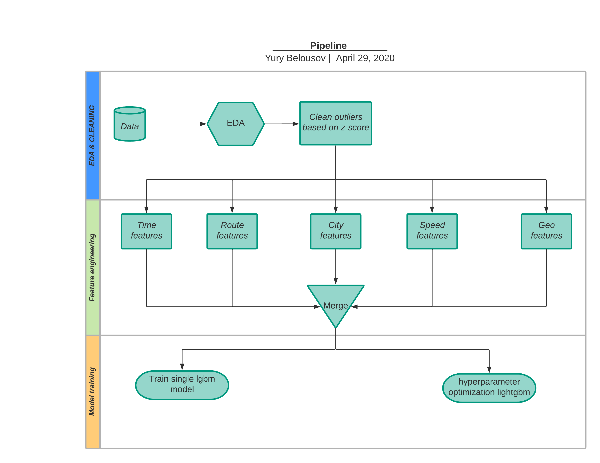
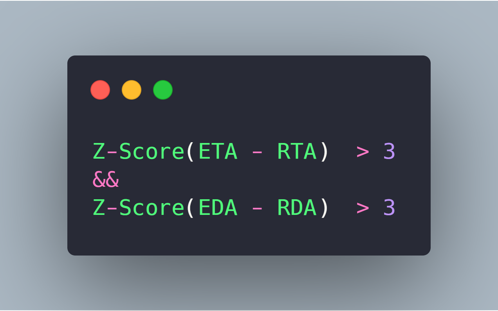
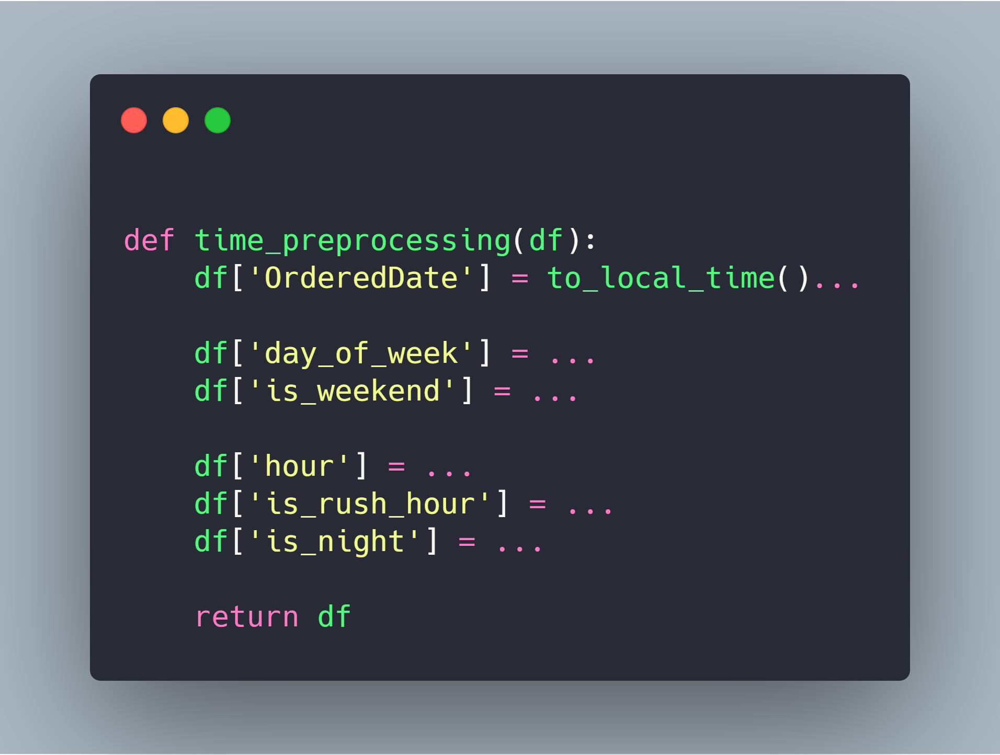
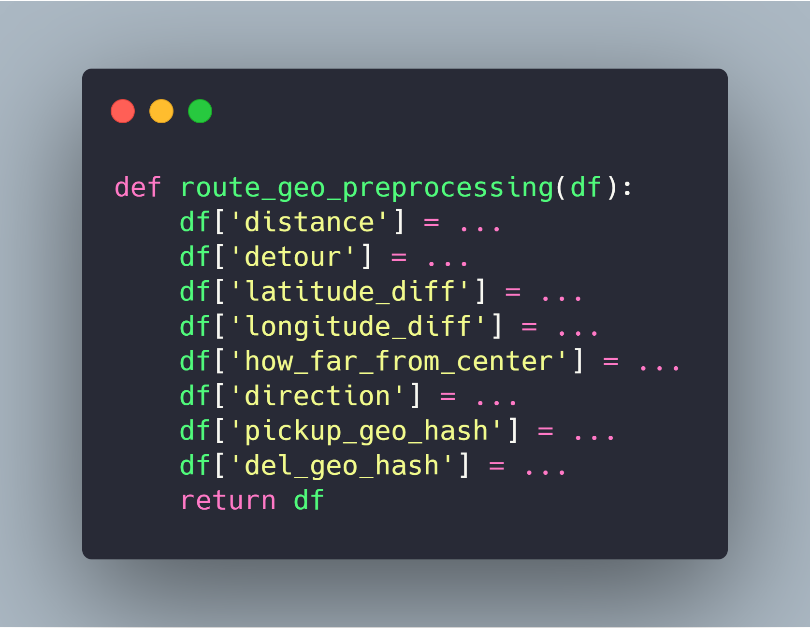
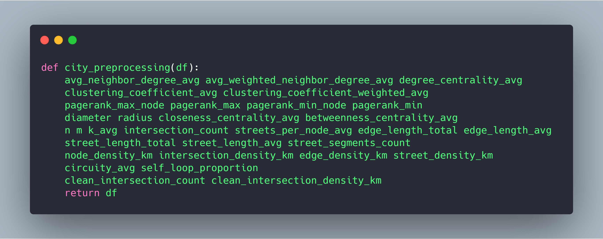
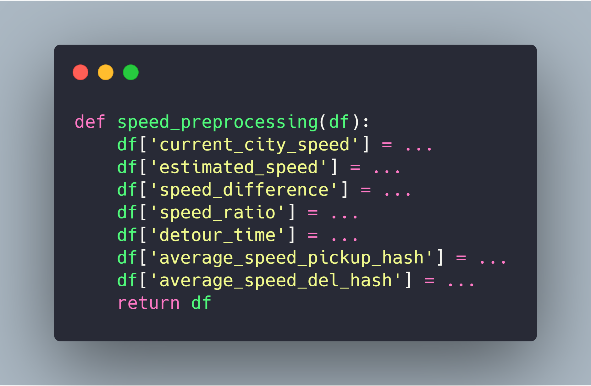
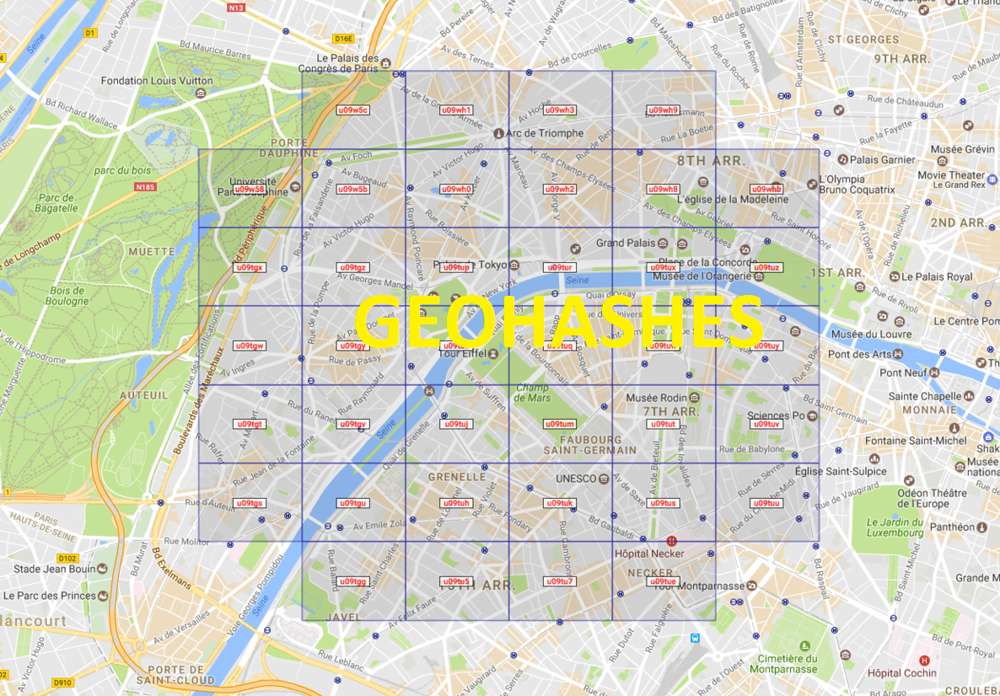
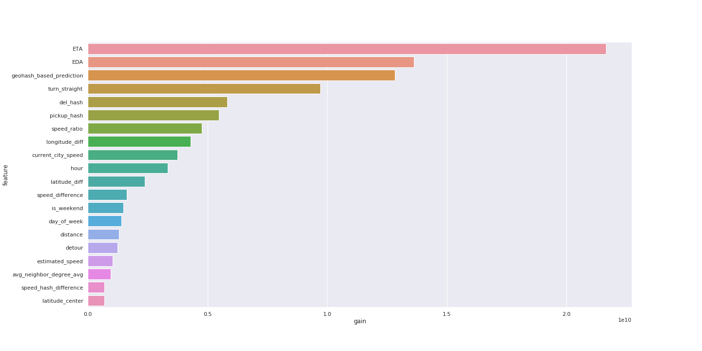

# Citymobil

***

**Код и разбор решения 3/4 места команды «команда».**

- [Структура репозитория](#структура-репозитория)
- [Схема решения](#схема-решения)
    - [Очистка данных](#очистка-данных)
    - [Feature Engineering](#feature-engineering)
    - [Обучение модели](#обучение-модели)
- [Результаты](#результаты)
- [Использованные библиотеки](#использованные-библиотеки)
- [Что пробовали ещё](#что-пробовали-ещё)
- [Состав команды](#состав-команды)

***

## Структура репозитория
```bash
citymobil-hack git:(master) ✗ tree -FL 1 | grep -v /$
.
├── 01.feature-engineering.ipynb — очистка данных, извлечение новых признаков
├── 02.geo-features.ipynb — построение гео-фичей
├── 03.lightgbm-model.ipynb — обучение модели lightgbm
├── 04.hpo-model.ipynb — подбор гиперпараметрво при помощи баейсовской оптимизации
├── citymobil-eta-команда.pdf — презентация решения
└── requirements.txt — все требуемые пакеты
```


## Схема решения
Весь pipeline решения выглядит следующим образом:



### Очистка данных
Лучше всего показал себя подход на основе `z-score`


### Feature Engineering
* **Фичи про время**

* **Фичи про маршрут**

* **Фичи про город**

* **Фичи про скорость**

* **Фичи про гео**  
Не все повороты одинаковы


### Обучение модели
* Используется одна модель `lightgbm`, при желании можно подобрать гиперпараметры при помощи `optuna`.
* Одно из ключевых: **предсказываем не `RTA` напрямую, а насколько ошибается текущая модель**. Это поможет лучше понять какие факторы влияют на ошибку модели

## Результаты
* весь pipeline выполняется ~20 минут
* `14.19307` на public и `14.24992` (сходится с локальной метрикой)
* Если посмотреть на feature importance — то в топе выделенные признаки

    * `turn_straight` - чем больше нужно ехать по прямой, тем мы быстрее
    * `current_city_speed` - средняя скорость по городу в данный час (на основе исторических данных)
    * `speed_ratio` - отношение предполагаемой скорости маршрута к скорости города (не можем ехать быстрее пробок)
    * `detour` - разница между длинной маршрута и путем напрямую — показывает насколько большой объезд
***

#### Использованные библиотеки
* [osmnx](https://github.com/gboeing/osmnx) — для получения информации про город из OpenStreetMap
* [python-geohash](https://pypi.org/project/python-geohash/) — для построения хэшей из координат, разбития на гео-кластеры
* [geopy](https://github.com/geopy/geopy) — для подсчета расстояния напрямую между конечной и начальной точками маршрута
* [vowpal_wabbit](https://github.com/VowpalWabbit/vowpal_wabbit) — для обучения линейной регрессии по кластерам
* [lightgbm](https://lightgbm.readthedocs.io/en/latest/index.html) — в качестве решающей функции
* [optuna](https://github.com/optuna/optuna) — для подбора гиперпараметров
* [shap](https://github.com/slundberg/shap) — для построения feature importance


#### Что пробовали ещё
* предсказывать отношение `ETA` к `RTA`; напрямую `RTA`
* обучать модели для каждого города
* разбивать на кластеры при помощи алгоритмов кластеризации (k-means)

#### Состав команды
* [@bruce-willis](https://github.com/bruce-willis) - feature engineering & model training & hpo
* [@Piteryo](https://github.com/Piteryo) - model training
* [@romech](https://github.com/romech) - GeoFeatures  
